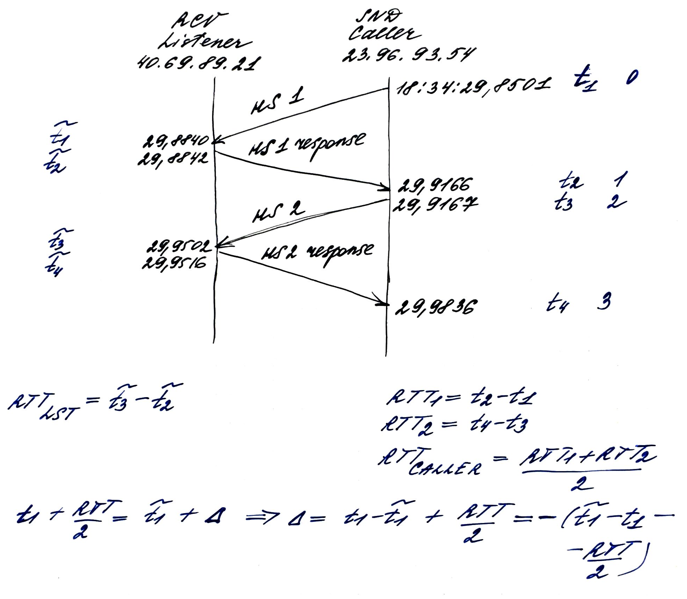

# Notes

## Aligning the clocks between peers

Before collecting the datasets, please make sure that all the peers use the same timebase, e.g., use NTP server to syncronize time between multiple machines.

Please also note that both `srt-xtransmit` and `tshark` use system time to generate an absolute timestamp.

It's importnant to note that:
* NTP has its own known error,
* In the process of transmission, system clocks might have been updated.

The mentioned above may affect the result time difference. This requires additional investigation. To troubleshoot, we can output the timestamps from the monotonic clocks in the stats generated by `srt-xtransmit`.

### Calculating the caller and sender clocks difference

The idea behind the calculation of clocks difference is the following

## Aligning datasets

### Aligning SRT sender and receiver statistics

1. The timeline of the sender statistics is used to generate the result dataframe timeline. First, the intersection between sender and receiver timelines is found so that the first and the last timepoints correspond to sender timepoints. Second, an interpolation of receiver data is done to fill in missing values that correspond to sender datapoints. Finally, after some manipulations with data, only sender datapoints are extracted to form the timeline of the result aligned dataframe.

2. It is important to note that currently before aligning sender and receiver statisitcs, there is no shift of receiver timeseries (by RTT/2) done. 

    Receiver statistics is statistics from the past. Ideally, before joining sender and receiver datasets, we should shift receiver stats up by RTT/2. However, there possible difficulties here: 1) During the transmission RTT varies; 2) The accuracy of RTT estimation; 3) Asymmetric networks when RTT from point A to point B is not equal to RTT from point B to point A.
    
    There are two possible approaches:
    * Calculate initial RTT from handshakes exchange and shift datasets by RTT_initial/2 under assumption that the experiment time is small enough to have no changes in RTT during transmission;
    * Extract RTT estimation from tshark data (UMSG_ACK packets) or use `msRTT` SRT statisitcs and shift receiver datasets accordingly. This requires additional research. Problems: a) Estimation accuracy; b) What will hapen in time moments where RTT changes dramatically?; c) Asymmetric networks.

Check [these notes](../_data/notes_useast_eunorth_10.02.20_100Mbps.pdf) for the illustration.

### Aligning SRT statistics and tshark data

SRT statistics here means aligned SRT sender and receiver statistics.

1. The timeline of the SRT statistics is used to generate the result dataframe timeline. First, tshark dump is processed to extract SRT UMSG_ACK control packets only that contain valuable for the further analysis information (e.g., rtt, bandwidth, and receiving speed estimations). Second, and intersection between SRT stats and tshark data is found so that the first and the last timepoints correspond to SRT stats timepoints. Next, an interpolation of tshark data is done to fill in missing values that correspond to SRT stats datapoints. Finally, after some manipulations with data, only SRT stats datapoints are extracted to form the timeline of the result aligned dataframe.

2. It is important to note that tshark data collected at the receiver (not sender) side is used when aligning datasets. It is done in order to get as closer (real) timestamp nearby tshark data as possible. The SRT receiver calculates estimations (e.g., rtt, bandwidth, and receiving speed estimations) right before sending an acknowledgement UMSG_ACK packet back to the SRT sender. This packet will be registered by tshark at the reciver side and contain an absolute timestamp of sending the packet. The timestamp of the same packet registered at the sender time will be shifted by RTT/2 plus there is allways an opportunity to loss the packet during transmission.

### Collecting the data

It's important to note that the SRT receiver sends acknowledgement packets (UMSG_ACK) back to the SRT sender each 10 ms (milliseconds). So it makes sense to collect SRT `.csv` statistics with the 10 ms interval to increase the accuracy when aligning SRT statistics and tshark dataframes. However there is no implementation limitations and the algorithm of joining datasets will work in case of smaller/larger value of the interval for collecting SRT `.csv` statistics. I would say, in case of larger value (e.g., 100 ms) we are safe, because SRT still sends acknowledgements each 10 ms.